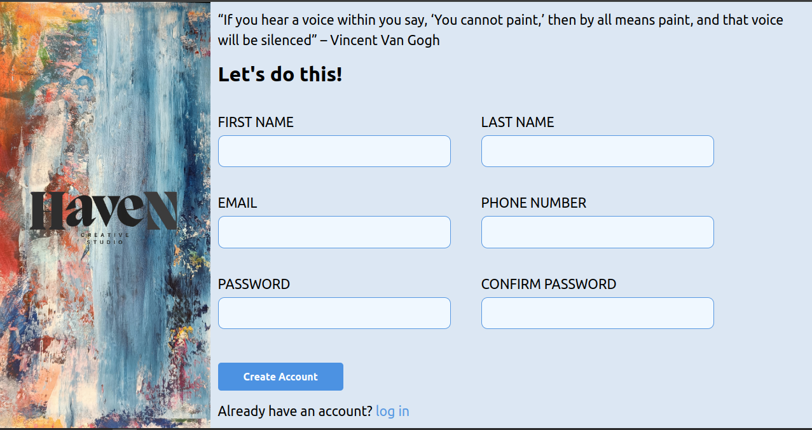

 
 

# Title: Odin Project Form Exercise - Hands-on Form Creation 

 # Description
Excercise for the Odin project to get my hands dirty with making Forms, notice that the form has no back end behaviour

## Time Spent 🕓

I spent a total of **9 hours and 23 minutes** working on this project, distributed over **2 days**.

**Most of the time i was deepen my knowledge on the form not just creating it ☺️**

| Day | Time Spent |
| --- | :---: |
| 1 | 8 hours and 8 minutes |
| 2 | 1 hours and 15 minutes |

## Technologies Used

- HTML
- CSS

## Demo

You can view a live demo of the sign-up-Form [here](https://hayam999.github.io/sign-up-Form).
